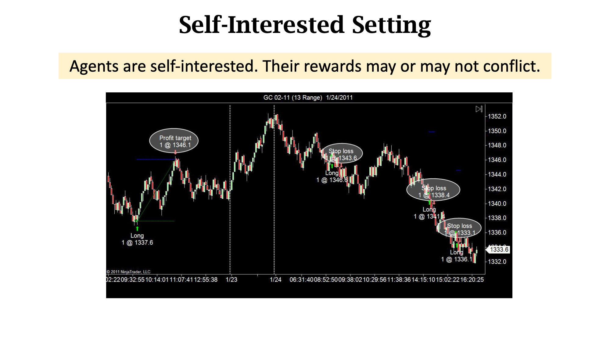

# Multi-Agent Reinforcement Learning
- [course](https://www.youtube.com/watch?v=KN-XMQFTD0o)

## Settings
- Cooperative Settings: Agents work together to achieve a common goal, sharing rewards or optimizing team performance. Examples include collaborative robotics or team-based games.

- Competitive Settings: Agents have conflicting objectives, leading to adversarial interactions. Examples include zero-sum games like chess or competitive markets.

- Mixed Settings: Environments with both cooperative and competitive elements, such as trading markets or sports.

- Self Interested: agents are those that act to maximize their own individual rewards without explicit regard for the goals or rewards of other agents. 

## Mathematics for Multi-Agent Reinforcement Learning (MARL)

### State Transition:
\[
p(s' \mid s, a^1, \dots, a^n) = \mathbb{P}(S' = s' \mid S = s, A^1 = a^1, \dots, A^n = a^n)
\]
- Represents the probability of transitioning to a new state \( s' \) given the current state \( s \) and actions \( a^1, \dots, a^n \) taken by all \( n \) agents.
- Each agent's action \( a^i \) contributes to the environment's dynamics.

### Reward (\( R \)):
- **Global Reward**: A single reward signal \( R \) shared among all agents, commonly used in cooperative settings.
- **Individual Reward**: Each agent \( i \) may receive its own reward \( R^i \), commonly used in competitive or mixed environments.
- Rewards depend on the specific **setting**:
  - **Cooperative**: Agents work together to maximize a shared reward.
  - **Competitive**: Agents work against each other, aiming to maximize their own rewards while minimizing others'.
  - **Mixed**: A combination of cooperative and competitive elements.

### Return (\( G_t \)):
\[
G_t = \sum_{k=0}^{\infty} \gamma^k R_{t+k}
\]
- The **return** is the cumulative reward starting from time \( t \), where \( \gamma \) is the discount factor (\( 0 \leq \gamma \leq 1 \)).
- For multi-agent systems:
  - **Global Return**: Sum of rewards shared by all agents.
  - **Individual Return**: Cumulative reward for each agent \( G_t^i \).

### Policy Network (\( \pi^i \)):
- Each agent \( i \) has its own **policy network**:
\[
\pi^i(a^i \mid s)
\]
- Represents the probability of agent \( i \) taking action \( a^i \) given the state \( s \).
- In fully cooperative settings, agents may share a centralized policy, while in decentralized settings, each agent has an independent policy.

### State Value Function (\( V(s) \)):
\[
V(s) = \mathbb{E}_{\pi^1, \dots, \pi^n} [G_t \mid S_t = s]
\]
- The expected global return starting from state \( s \), considering the joint policies \( \pi^1, \dots, \pi^n \).

### Action Value Function (\( Q(s, a^1, \dots, a^n) \)):
\[
Q(s, a^1, \dots, a^n) = \mathbb{E}_{\pi^1, \dots, \pi^n} [G_t \mid S_t = s, A_t^1 = a^1, \dots, A_t^n = a^n]
\]
- The expected global return starting from state \( s \), when all agents take actions \( a^1, \dots, a^n \), and then follow their respective policies.

### Centralized vs. Decentralized Value Functions:
- **Centralized**:
  - Uses the full state \( s \) and joint actions \( a^1, \dots, a^n \) for training.
  - Common in environments where agents can share information during training.
- **Decentralized**:
  - Each agent learns its own value function based on its local observations:
\[
Q^i(o^i, a^i) = \mathbb{E}_{\pi^i} [G_t^i \mid O_t^i = o^i, A_t^i = a^i]
\]
  - \( o^i \): Observation of agent \( i \).

### Monotonic Value Function Factorization:
- In cooperative settings, centralized value functions can be **decomposed** into individual agent contributions:
\[
Q(s, a^1, \dots, a^n) = \sum_{i=1}^n Q^i(o^i, a^i)
\]
- Ensures that improving individual agent \( Q^i \) improves the global \( Q(s, a^1, \dots, a^n) \).

### Relationships:
- The **state value function** is the expected return under the joint policies:
\[
V(s) = \mathbb{E}_{a^1, \dots, a^n \sim \pi^1, \dots, \pi^n} [Q(s, a^1, \dots, a^n)]
\]

### Converge
- 无法通过改变策略获得更大期望回报
- 收敛=纳什均衡
- 一个agent policy改变，其他也会变，因此无法收敛

### Actor-Critic Methods